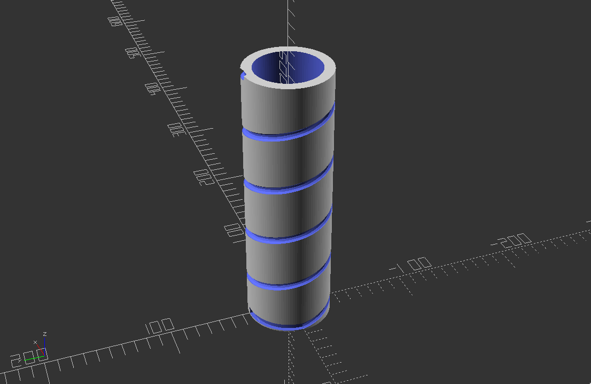

# helical_antenna.scad
An [OpenSCAD](http://www.openscad.org/) script to generate a helical antenna. The model runs the wire in parallell with the reflector for 1/4-wavelength to match the impedance with 50Ω.
The default values allow the antenna to be mounted on areflector with an m3 screw and nut.

The script depends on [dotSCAD](https://github.com/JustinSDK/dotSCAD). Put it in a folder called `dot` somewhere where OpenSCAD can find it.

Change the variables in the script to edit the parameters.

